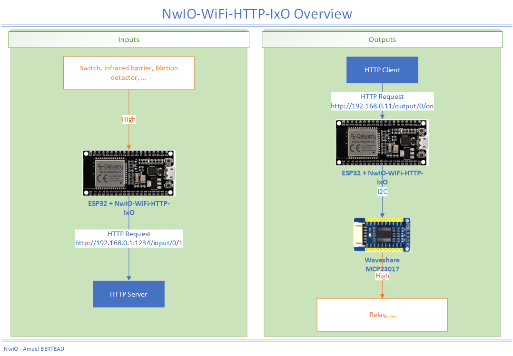

# NwIO-WiFi-HTTP-IxO
[![CC BY-NC-SA 4.0][cc-by-nc-sa-shield]][cc-by-nc-sa]

## About The Project
This program allows to use an ESP32 to control 32 Inputs/Outputs over HTTP using WiFi Connection.

- 16 inputs (ESP32 GPIO)
- 16 outputs (Waveshare MCP23017 GPIO)

### Features
- send the state of an input to an HTTP server
- set the state of an output by HTTP calls



<!-- GETTING STARTED -->
## Getting Started
### Hardware
- ESP32 NodeMCU
- Waveshare MCP23017 IO Expansion Board (connected on ESP32 using I2C)

[About Hardware](../doc/About-Hardware.md)

### Software
This program is edited using PlatformIO.

#### If you use Arduino IDE
- Import code in Arduino IDE
- Enable the `Path variable` support for ESPAsyncWebServer

The procedure is detailed in [Using Arduino IDE](../doc/Using-ArduinoIDE.md).

### Configuration
Before uploading program to your ESP32, you must configure settings (IP Address, ...).

[Configuration](configuration.md)

<!-- USAGE EXAMPLES -->
## Usage
### Send input state to HTTP Server

Each change of state triggers an HTTP request to following URL (depending value of `deviceId`)

| When `deviceId` is | HTTP request is sent to                                      |
|--------------------|--------------------------------------------------------------|
| Empty String ("")  | `http://{server}:{serverPort}/input/{id}/{state}`            |
| Non-empty String   | `http://{server}:{serverPort}/input/{deviceId}/{id}/{state}` |

| Parameter | Description       | Values                                   |
|-----------|-------------------|------------------------------------------|
| deviceId  | Device identifier | Value of `deviceId` in Configuration.hpp |
| id        | Input id          | See [io-mappings](io-mappings.md)        |
| state     | Input state       | `0` or `1`                               |

#### Examples
##### Example A
Given the following configuration :
```
IPAddress server(192, 168, 0, 1);
int serverPort = 1234;
...
String deviceId = "";
```
| When                 | HTTP request is sent on             |
|----------------------|-------------------------------------|
| Input 0 changes to 0 | `http://192.168.0.1:1234/input/0/0` |
| Input 0 changes to 1 | `http://192.168.0.1:1234/input/0/1` |

##### Example B
Given the following configuration :
```
IPAddress server(192, 168, 0, 1);
int serverPort = 1234;
...
String deviceId = "deviceA";
```
| When                 | HTTP request is sent on                     |
|----------------------|---------------------------------------------|
| Input 0 changes to 0 | `http://192.168.0.1:1234/input/deviceA/0/0` |
| Input 0 changes to 1 | `http://192.168.0.1:1234/input/deviceA/0/1` |

### Set output state with HTTP calls
To set output state, call following URL ``http://{ip}/output/{id}/{state}/{duration}``

| Parameter | Description                            | Values                            |
|-----------|----------------------------------------|-----------------------------------|
| id        | Output id                              | See [io-mappings](io-mappings.md) |
| state     | Output state                           | `off` or `on`                     |
| duration  | Duration (ms) Only available for "on"  | `1` to `65535`                    |

#### Examples
Given the following configuration :
```
IPAddress ip(192, 168, 0, 11);
```

| Usage                          | URL to call                            |
|--------------------------------|----------------------------------------|
| Enable output 0                | `http://192.168.0.11/output/0/on`      |
| Disable output 0               | `http://192.168.0.11/output/0/off`     |
| Enable output 0 during 2000 ms | `http://192.168.0.11/output/0/on/2000` |

### Set all outputs state with HTTP calls
To set all outputs state, call following URL `http://{ip}/outputs/{state}`

| Parameter | Description    | Values        |
|-----------|----------------|---------------|
| state     | Output state   | `off` or `on` |

#### Examples
Given the following configuration :
```
IPAddress ip(192, 168, 0, 11);
```

| Usage                          | URL to call                          |
|--------------------------------|--------------------------------------|
| Enable all outputs             | `http://192.168.0.11/outputs/on`     |
| Disable all outputs            | `http://192.168.0.11/outputs/off`    |

<!-- LICENSE -->
## License
This work is licensed under a
[Creative Commons Attribution-NonCommercial-ShareAlike 4.0 International License][cc-by-nc-sa].

See [LICENSE](../LICENSE) for more information.

[![CC BY-NC-SA 4.0][cc-by-nc-sa-image]][cc-by-nc-sa]

## Built With
- me-no-dev/AsyncTCP [Repository](https://github.com/me-no-dev/AsyncTCP)
- me-no-dev/ESPAsyncWebServer [Repository](https://github.com/me-no-dev/ESPAsyncWebServer)
- adafruit/Adafruit-MCP23017-Arduino-Library [Repository](https://github.com/adafruit/Adafruit-MCP23017-Arduino-Library)

## Authors
* **Amael BERTEAU**

<!-- CONTACT -->
## Contact
- [Project page (Personal Website)](https://amaelberteau.com/projects/nwio) (French)
- [Facebook Page "Le Lab d'Amael"](https://www.facebook.com/amael.lab) (French)

<!-- MARKDOWN LINKS & IMAGES -->
[linkedin-shield]: https://img.shields.io/badge/-LinkedIn-black.svg?style=for-the-badge&logo=linkedin&colorB=555
[linkedin-url]: https://linkedin.com/in/amael-berteau
[cc-by-nc-sa]: http://creativecommons.org/licenses/by-nc-sa/4.0/
[cc-by-nc-sa-image]: https://licensebuttons.net/l/by-nc-sa/4.0/88x31.png
[cc-by-nc-sa-shield]: https://img.shields.io/badge/License-CC%20BY--NC--SA%204.0-lightgrey.svg
