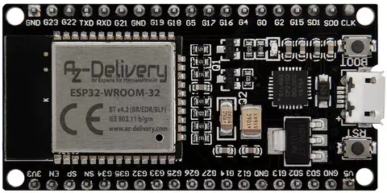
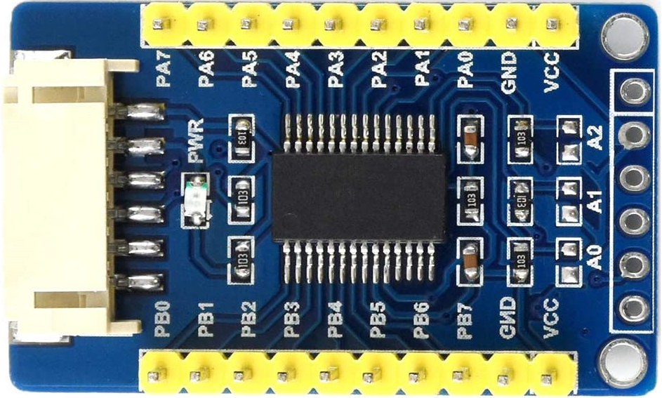

# About Hardware
## ESP32

The programs in this project work on ESP32 NodeMCU.

(I use "ESP32 NodeMCU Module WLAN WiFi Development Board with CP2102")

For more information :
- [AZ Delivery](https://www.az-delivery.de/en/products/esp32-developmentboard)
- [Amazon.fr](https://www.amazon.fr/gp/product/B071P98VTG/)

## MCP23017
Some programs in this project use Waveshare MCP23017 IO Expansion Board.

For more information :
- [Waveshare MCP23017 IO Expansion Board](https://www.waveshare.com/wiki/MCP23017_IO_Expansion_Board)
- [Amazon.fr](https://www.amazon.fr/Waveshare-MCP23017-IO-Expansion-Board/dp/B07P2H1NZG)

### Connection
| MCP23017 | ESP32      |
|----------|------------|
| INTB     | -          |
| INTA     | -          |
| SCL      | SCL (IO22) |
| SDA      | SDA (IO21) |
| GND      | GND        |
| VCC      | 3.3V       |

### I2C Address
| A2   | A1   | A0   | Address (HEX) |
|------|------|------|---------------|
| LOW  | LOW  | LOW  | `0x20`        |
| LOW  | LOW  | HIGH | `0x21`        |
| LOW  | HIGH | LOW  | `0x22`        |
| LOW  | HIGH | HIGH | `0x23`        |
| HIGH | LOW  | LOW  | `0x24`        |
| HIGH | LOW  | HIGH | `0x25`        |
| HIGH | HIGH | LOW  | `0x26`        |
| HIGH | HIGH | HIGH | `0x27`        |

Welding A0, A1, A2 and impact on Address will depend of our module.

#### For Waveshare MCP23017 IO Expansion Board :
Default address of module is `0x27`.

By default, A2, A1, A0 are all `HIGH` without welded. If you want to turn them to `LOW`, you should short these welding points.

For example, Welding A0 set it to `LOW` and the address of module will be `0x26`.

[User Manual](https://www.waveshare.com/wiki/File:MCP2307_IO_Expansion_Board_User_Manual_EN.pdf)
