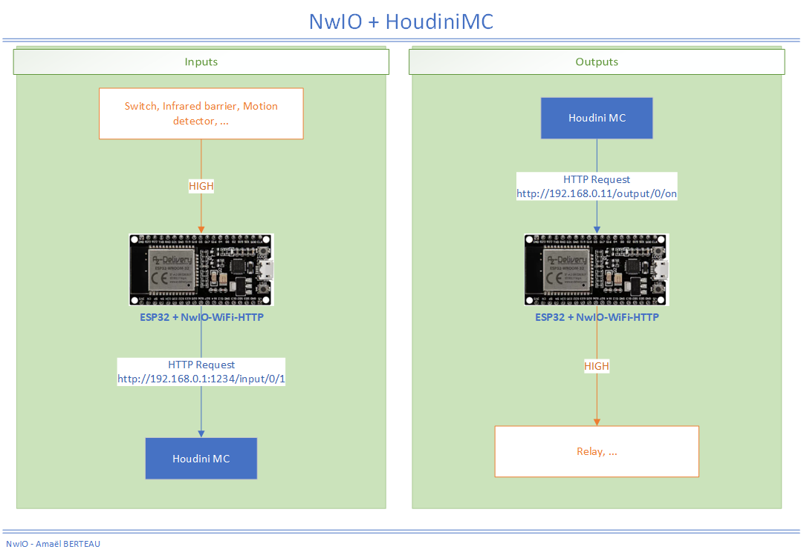
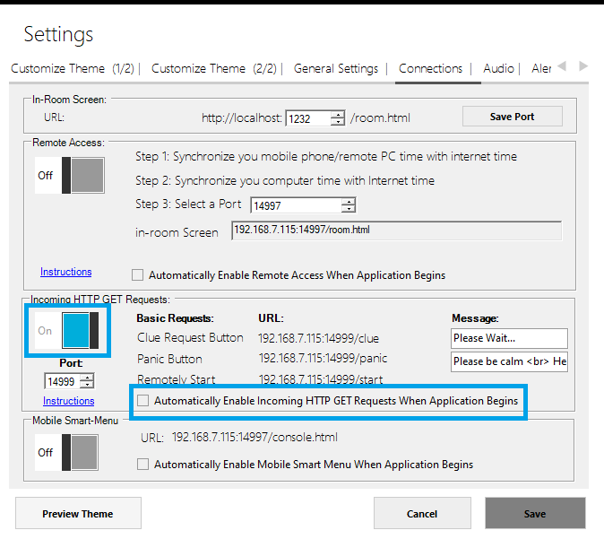
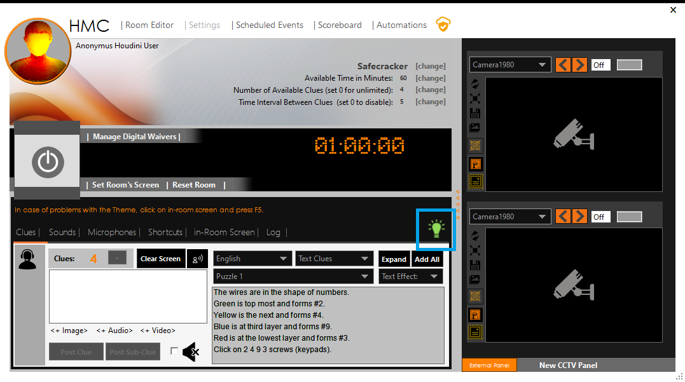
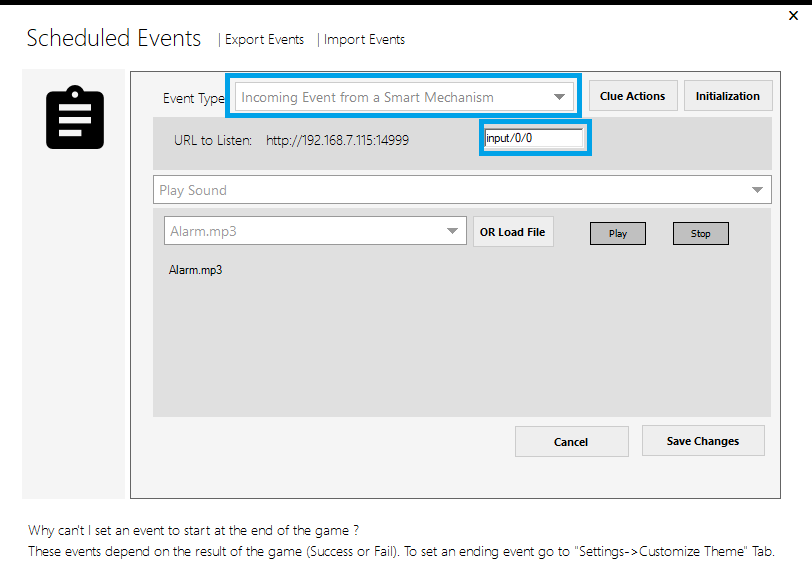
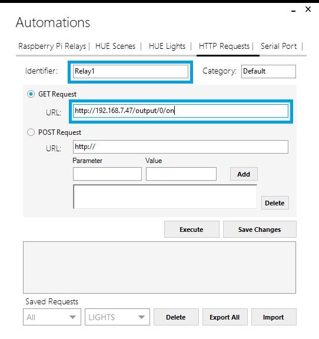

# Interactions with Houdini MC
## About
NwIO allows to use an ESP32 to control inputs/outputs over HTTP using WiFi Connection.
- It sends the state of an input to an HTTP server
- It can change the state of an output depending on HTTP calls

Therefore, an ESP32 running NwIO can interact with Houdini MC using web requests :
- It can enable/disable output when it receives a web request from Houdini MC
- Houdini-MC can perform a custom action when the state of an esp32 input changes (NwIO sends an HTTP request each time an input status changes)



## Configuration
Given the following network information :

**Network**

| Settings | URL             |
|----------|-----------------|
| Network  | `192.168.7.0`   |
| Gateway  | `192.168.7.254` |
| Subnet   | `255.255.0`     |

**Houdini MC**

| Settings   | URL             |
|------------|-----------------|
| IP Address | `192.168.7.115` |
| Port       | `14999`         |

**ESP32**

| Settings   | URL            |
|------------|----------------|
| IP Address | `192.168.7.47` |


### Houdini MC Configuration

#### Allowing Houdini MC to perform as a receiver
- Go on "_Settings_" menu
- Click on "_Connections_" Tab
- Enable the "_Incoming HTTP Requests_" by clicking on the switch in the "_Incoming HTTP GET Requests_" section.
If you want Houdini MC to accept incoming requests after program restart, you have to check "_Automatically Enable Incoming HTTP GET Requests When Application begins_"



- Note down the given URLs, we will use them to test that the program accepts incoming requests
- Press "Save"

Houdini MC is ready to accept incoming requests.

You will now notice a green bulb icon on the top of the console. This icon indicates that Houdini MC is ready to accept incoming requests.


To test the ability of the software, open a browser on another device (computer, tablet, mobile) connected to the same network and try to access previously noted URLs. In our case, the URL for "Clue Button" is `http://192.168.7.115:14999/clue` and the URL for "Panic Button" is `http://192.168.7.115:14999/panic`.

**⚠** Outgoing and incoming connections can be affected by the presence of firewalls or antivirus software on the PC connection. Windows comes with a built-in Internet Firewall that is active by default and blocks suspicious traffic. You can turn off this firewall (not recommended by Microsoft) or configure it to allow connections from and to specific ports.

#### How to receive state changes of an input from an ESP32 running NwIO

- Go on "_Scheduled Events_" menu
- Click on "_Add Event_"
- In "_Event Type_", select "_Incoming Event from Smart Mechanism_"
- Set "_Custom_Term_" depending on the input and the state to be monitored.

(URLs called by NwIO are in the format `http://{server}:{serverPort}/input/{id}/{state}`, so the "_Custom_Term_" will be `input/{id}/{state}`)

In the depicted case, we use `input/0/0` that means this event will be executed when Input 0 change to 0.



Some examples of Custom Terms depending on input and state to monitor :

| Input/State to monitor | Custom_Term |
|------------------------|-------------|
| Input 0 changes to 1   | `input/0/1` |
| Input 1 changes to 0   | `input/1/0` |
| Input 1 changes to 1   | `input/1/1` |
| ...                    | ...         |

- Select action (e.g. play a sound, trigger another device, play video, control HUE scenes, etc.)
- Press "_Save Event_"

Now, every time a connected on the same network device calls this URL when the game is active, the event will be executed.

To test this smart event, open a browser on another device (computer, tablet, mobile) connected on the same network and try to access this URL (In the depicted case `http://192.168.7.115:14999/input/0/0`).

### How to enable/disable an output on an ESP32 running NwIO
You can use **Automation** to send **GET** and **POST** requests to an ESP32 which will allow to enable/disable outputs

- Go on "_Automations_" menu
- Click on "_HTTP Requests_" Tab
- Create a new GET or POST request
- Name the request (in the depicted case is "Relay1")
- Select "_GET Request_" and set URL depending on the output and state you want to change. (URLs are in the format `http://{esp32_ip}/output/{id}/{state}`)

In the depicted case, we use `http://192.168.7.47/output/0/on` that means it will enable output 0.



Some examples of URLs depending on output and state :

| Usage                          | URL                                    |
|--------------------------------|----------------------------------------|
 | Disable output 0               | `http://192.168.7.47/output/0/off`     |
 | Enable output 0 during 2000 ms | `http://192.168.7.47/output/0/on/2000` |
| Enable output 1                | `http://192.168.7.47/output/1/on`      |
| Disable output 1               | `http://192.168.7.47/output/1/off`     |
| ...                            | ...                                    |

- Press "_Execute_" to send the request
- The Response text box will display the response from the ESP32 (Empty)
- By pressing the "_Save Changes_" button, the selected web request can be stored for later use. Stored requests are available under the "_Saved Requests_" section.

Stored requests are accessible not only from the "_Automations_" menu but also from the "_Shortcuts_" tab.

Finally, it is worth noting that stored requests can also be executed as part of scheduled events. Simply, go on "_Scheduled events_" select a new timed on a smart event and assign the stored web request. If timed events are used, Houdini MC will send the stored web request on a specific timestamp. In case of smart events, Houdini MC will send the stored web request when e.g. players solve a riddle.

### NwIO Configuration
- Open [configuration.hpp](../../NwIO-WiFi-HTTP/src/Configuration.hpp)
- Edit your settings

In the depicted case :
```
IPAddress ip(192, 168, 7, 47);
IPAddress gateway(192, 168, 7, 254);
IPAddress subnet(255, 255, 255, 0);

...

IPAddress server(192, 168, 7, 115);
int serverPort = 14999;
...
```
- Upload the program to your ESP32

(For more information [Configuration](../../NwIO-WiFi-HTTP/configuration.md)
ESP32 si running NwIO.
